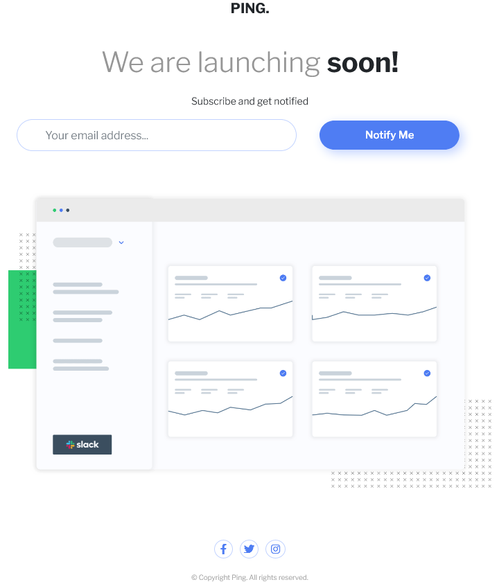

# Frontend Mentor - Ping coming soon page solution

This is a solution to the [Ping coming soon page challenge on Frontend Mentor](https://www.frontendmentor.io/challenges/ping-single-column-coming-soon-page-5cadd051fec04111f7b848da). Frontend Mentor challenges help you improve your coding skills by building realistic projects. 

## Table of contents

- [Overview](#overview)
  - [The challenge](#the-challenge)
  - [Screenshot](#screenshot)
  - [Links](#links)
- [My process](#my-process)
  - [Built with](#built-with)
  - [What I learned](#what-i-learned)
  - [Continued development](#continued-development)
  - [Useful resources](#useful-resources)
- [Author](#author)

## Overview

### The challenge

Users should be able to:

- View the optimal layout for the site depending on their device's screen size
- See hover states for all interactive elements on the page
- Submit their email address using an `input` field
- Receive an error message when the `form` is submitted if:
	- The `input` field is empty. The message for this error should say *"Whoops! It looks like you forgot to add your email"*
	- The email address is not formatted correctly (i.e. a correct email address should have this structure: `name@host.tld`). The message for this error should say *"Please provide a valid email address"*

### Screenshot

### Links

- Solution URL: https://github.com/GColville/Ping-Coming-Soon-Page/
- Live Site URL: https://gcolville.github.io/Ping-Coming-Soon-Page/

## My process

### Built with

- Semantic HTML5 markup
- Bootstrap
- Flexbox
- Mobile-first workflow

### What I learned

I learned a little more about using Bootstrap for responsive layouts and form validation.

### Continued development

I need to learn more about form validation using JavaScript to fully complete this challenge.

### Useful resources

- https://getbootstrap.com/docs/5.1/ - This helped me with form validation and styling.

## Author

- Frontend Mentor - [@yourusername](https://www.frontendmentor.io/profile/GColville)
- Twitter - [@yourusername](https://www.twitter.com/wanna_be_dev)